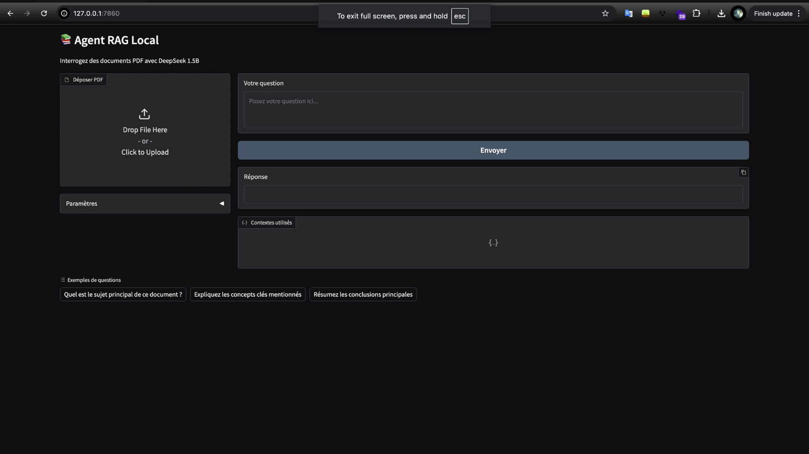

# 📚 Agent RAG Local

Agent RAG Local est une application permettant d'interroger des documents PDF en utilisant un modèle de langage et un index sémantique basé sur FAISS.

## 🛠️ Fonctionnalités
- Extraction et segmentation de texte à partir de fichiers PDF.
- Indexation des documents avec FAISS pour une recherche efficace.
- Recherche hybride combinant similarité sémantique et recherche par mots-clés.
- Génération de réponses avec le modèle **DeepSeek 1.5B** via Ollama.
- Interface utilisateur interactive avec **Gradio**.

## 📸 Capture d'écran


## 🚀 Installation
### Prérequis
- Python 3.8+
- Pip
- Ollama installé et configuré
- ollama start
- ollama pull deepseek-r1:"replace with number of parameters"

### Installation des dépendances
```bash
pip install -r requirements.txt
```

# 🏃 Utilisation

## Lancer l'application :

```bash
python app.py
```

1. Ouvrir le lien généré dans un navigateur.
2. Déposer un fichier PDF et poser une question.

# 📂 Structure du projet

```bash
.
├── app.py               # Fichier principal contenant l'interface Gradio
├── rag_module.py        # Module contenant le traitement des documents et la recherche
├── requirements.txt     # Liste des dépendances
├── README.md            # Documentation
└── screenshot.png       # Capture d'écran de l'application
```

# 📝 Paramètres

- **Nombre de contextes** : Définit le nombre de morceaux de texte pertinents récupérés pour répondre à une question.
- **Créativité** : Ajuste la température du modèle pour influencer la diversité des réponses générées.

# 📜 Licence

Ce projet est sous licence MIT.

# 📧 Contact

Pour toute question, contactez-moi à **your.email@example.com**.
